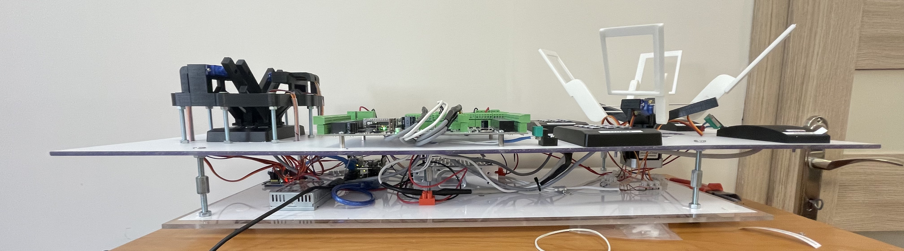

# Validation of Access Control Readers

## Project Objective and General Operation
The goal of this project was to automate the validation process of card readers and keypads within an access control system. When producing readers on a large scale, a small percentage of devices may not function correctly.

The entire setup is divided into two segments:
1. **Keypad Validation Segment:** This segment tests the proper functioning of the reader's keypad by pressing the appropriate keys. 

     

2. **Card Reader Validation Segment:** This segment tests the proper functioning of four access control card readers by presenting various cards to them.

  

The core of the electronic system is an Arduino UNO with an Ethernet Shield. Control is carried out through a web browser by entering the appropriate IP address within the same network. By entering the address or pressing the appropriate button in the browser, the Arduino sets the proper output states, causing the specified task to be executed.

## Hardware
**Components Used:**
- Arduino UNO
- Ethernet Shield 2
- SD Card
- 12V Power Supply
- 2x NO (Normally Open) Buttons
- 19x SG-90 Servos
- 12V-5V Transformer
- 5V to 15V Step-up Transformer in DIP Package
- Stepper Motor
- PCA9685 PWM Driver Module
- Wires
- PCB Board

## Software
The main program is written in the Arduino language, which is based on C. The program is named [Sprawdzanie_czytnikow.ino](program_niskopoziomowy/Sprawdzanie_czytnikow.ino) and includes functions such as zeroing the position of motors, implementing various libraries, network settings, defining inputs/outputs, and initiating communication with the module via the I2C bus. The HTML, CSS, and JS code for the web page should be uploaded to the SD card and inserted into the Arduino.

## Example

  **Entering the Appropriate IP Address in the Browser:**
   By default, this is set to `10.0.0.20`, but it can be changed in the [Sprawdzanie_czytnikow.ino](program_niskopoziomowy/Sprawdzanie_czytnikow.ino) code. The following page appears:   
   
   

2. **Testing a Reader Labeled 'B' by Presenting Card Number 4:**
   Select `4_B`. The mechanism rotates so that card 4 is positioned over reader B. The card is then moved closer to and away from the reader.

3. **Entering Code `1234#` on the Keypad:**
   Select `1`. The Arduino sends information to the PWM driver, which signals the first servo to move to the appropriate position, then return to default. The remaining combination is selected in a similar manner.

## Final results

### In the future, a high-level program will automatically send commands to the Arduino and verify whether the card was read correctly.
